# 07 — Architecture Diagrams

> Mermaid diagrams describing the **current** architecture (anchored to the actual codebase) and **recommended** future flows (clearly labelled). All diagrams render in any markdown viewer that supports Mermaid (GitHub, GitLab, VS Code preview, Obsidian, etc.).

---

## 1. Solution / project dependency graph

The arrows below come directly from `<ProjectReference>` declarations in each `.csproj`.

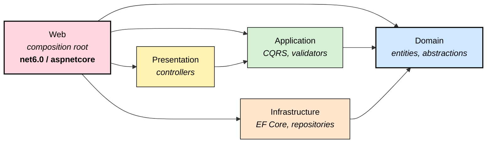

**Key observations:**
- Domain is a leaf node (depends on nothing).
- Application and Infrastructure both depend only on Domain — they don't see each other, which is the canonical Clean Architecture variant.
- Web is the only project that knows about all four.
- *Recommended change* (per File 06 §5): introduce `Infrastructure → Application` so Infrastructure can implement Application-defined abstractions like `ISqlConnectionFactory` and `IEmailSender`. This is the standard Clean Architecture refinement.

---

## 2. Clean Architecture rings (conceptual)

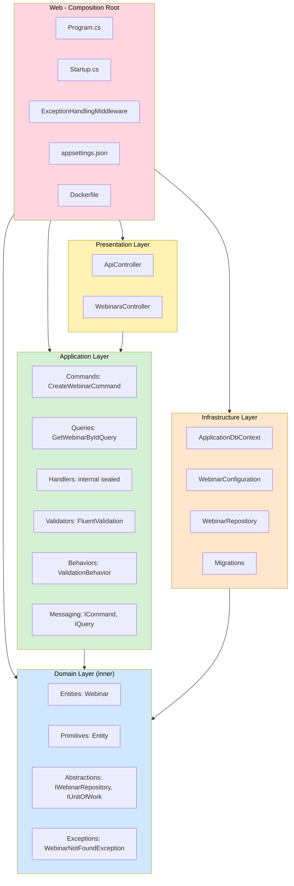

---

## 3. Write-path request flow (POST /api/webinars)

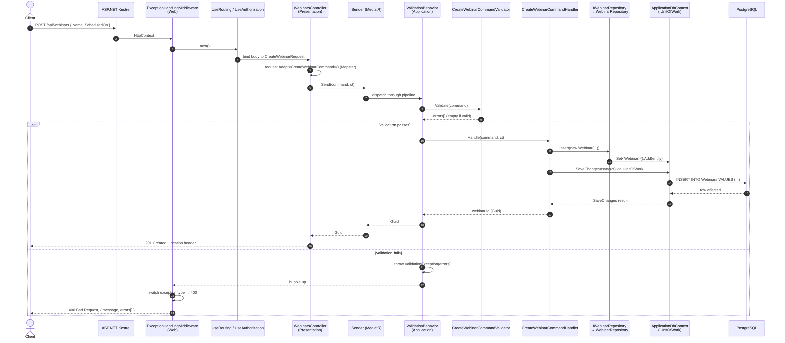

---

## 4. Read-path request flow (GET /api/webinars/{id})

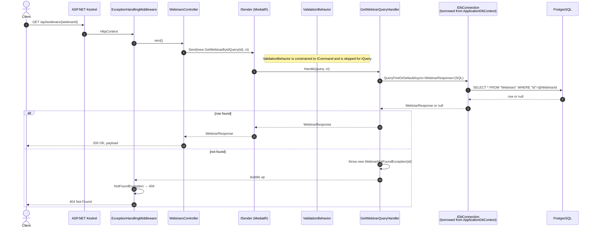

> **Issue called out earlier (File 03 §5):** the read path injects `System.Data.IDbConnection` directly into the Application handler and embeds raw SQL. This couples Application to Infrastructure. The "Recommended read path" diagram below shows the target shape after the fix.

---

## 5. Recommended read-path flow (post File 03 §5 fix)

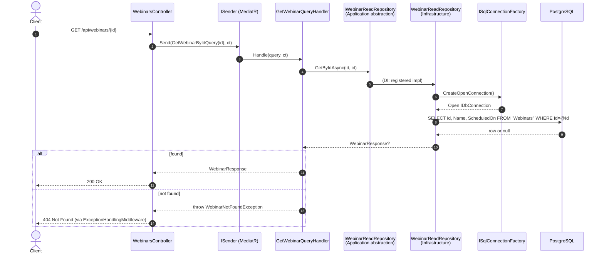

Application code no longer imports `System.Data`. SQL lives entirely in Infrastructure.

---

## 6. Authentication flow

### Current state — none

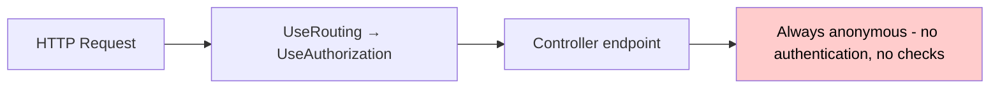

**Reality:** every endpoint is publicly accessible. `app.UseAuthorization()` in `Startup.cs:85` runs but has nothing to enforce because `services.AddAuthentication()` was never called.

### Recommended JWT bearer flow (after File 03 §2)

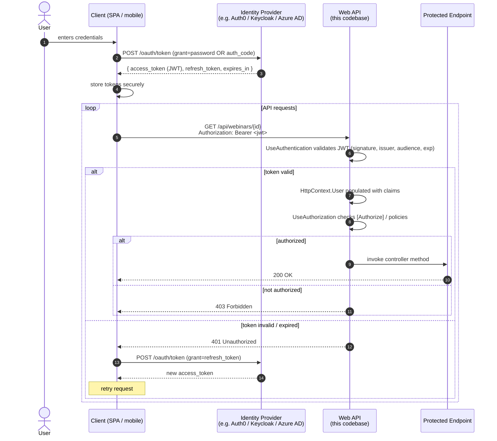

---

## 7. Database interaction flows — write vs read (current)

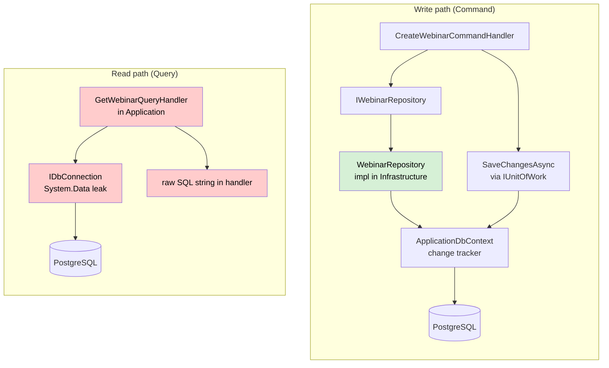

Two patterns, two layers of code that the read side genuinely should not be touching. File 03 §5 fixes the read path to mirror the write path's structure.

---

## 8. Integration flow (recommended pattern — not currently in the code)

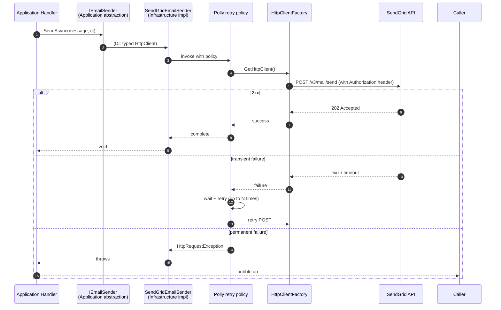

---

## 9. Background-job flow (recommended Hangfire pattern)

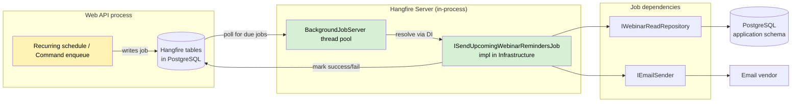

---

## 10. Outbox / domain-event flow (recommended, for cross-context async events)

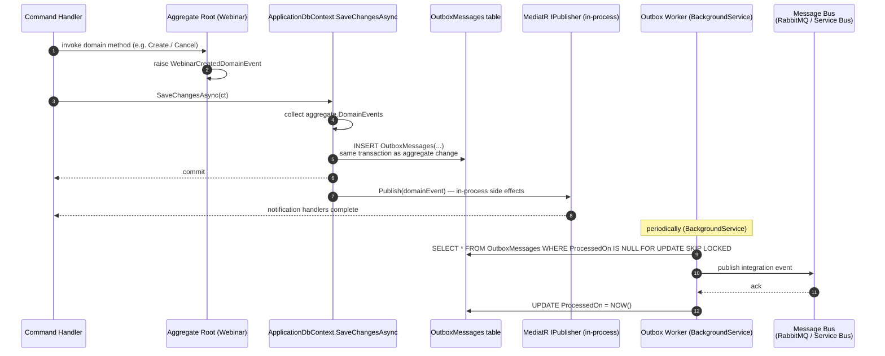

Guarantees:
- Aggregate change and Outbox row are **atomic** (same DB transaction).
- Integration event delivery is **at-least-once** — consumers must be idempotent.
- In-process notification handlers run **after commit**, never before — preventing "event fired but data not saved" anomalies.

---

## 11. Layered responsibility heatmap (current state)

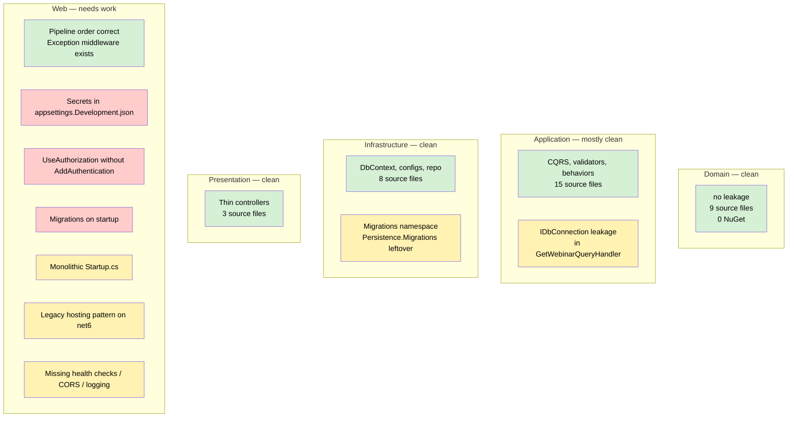

Green: clean. Yellow: medium concern. Red: critical.

---

## 12. Module decomposition (recommended target — modular monolith)

Forward-looking. When the codebase grows to multiple aggregates, organize as feature modules:

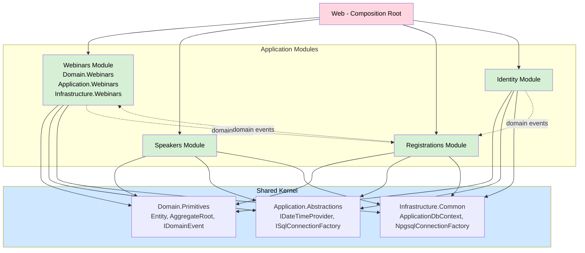

Each module is its own folder layout (with internal Domain / Application / Infrastructure sub-namespaces) and communicates with peers **only** via shared domain events or a publicly defined module API. This is the realistic next step after the foundational fixes in Files 03-04. See File 04 §12 for the full evolution.

---

## 13. Where each diagram lives in the file system

| Diagram | Relates to |
|---------|------------|
| §1 — Solution dependency graph | every `.csproj` |
| §2 — Clean Architecture rings | layering principle |
| §3 — Write-path flow | `WebinarsController.CreateWebinar`, `CreateWebinarCommandHandler`, `WebinarRepository`, `ApplicationDbContext` |
| §4 — Read-path flow (current) | `WebinarsController.GetWebinar`, `GetWebinarQueryHandler` (with the `IDbConnection` leak) |
| §5 — Read-path flow (recommended) | post-refactor `IWebinarReadRepository` / `ISqlConnectionFactory` |
| §6 — Authentication flow | currently empty; recommended JWT path |
| §7 — DB interaction (current) | mixed write/read patterns |
| §8 — Integration flow (recommended) | typed HttpClients + Polly |
| §9 — Background-job flow (recommended) | future Hangfire adoption |
| §10 — Outbox flow (recommended) | future cross-context events |
| §11 — Responsibility heatmap | composite of all audit findings |
| §12 — Modular monolith target | future state |
